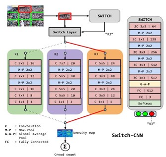

# Contagem de Multidões através de Rede Neural Convolucional:

## 1. Introdução:

Contagem de multidões através de visão computacional e rede neural é um tema que, embora discutido há muitos anos, ganhou notoriedade novamente, devido às recomendações da Organização Mundial da Saúde sobre o distanciamento e isolamento social para diminuir o contágio em massa da covid-19 doença causada pelo novo coronavírus (OMS, 2020). 

Vigilância visual e computação é um dos assuntos discutidos no PETS (Performance Evaluation of Tracking and Surveillance). O PETS é uma conferência anual da Universidade de Reading, do Reino Unido, no qual pesquisadores da área de vigilância visual se reúnem e analisam um único dataset. Dessa forma é possível avaliar o desempenho dos métodos e técnicas de rastreamento, visto que um dos desafios para a avaliação sistemática e para a comparação dos algoritmos é a variabilidade do banco de dados de treinamentos. Assim, com um banco de dados fornecido exclusivamente para a avaliação de técnicas no evento é possível discutir os desempenhos dos diferentes métodos.

Em 2009, o tema abordado no PETS, foi a análise de cenas de multidões (PETS 2009). Essa análise possui vários desafios científicos, tais quais, a inter oclusão devido à diferente alturas das pessoas, ambientes não presentes no conjunto de treinamento e objetos presentes no ambiente (Sam, D., 2017). Existem diversas abordagens que permitem soluções para esses eventuais desafios, como por exemplo redes neurais convolucionais (Convolutional Neural Network ou CNN).

Segundo Géron (2017), as redes neurais convolucionais (CNNs) emergiram do estudo do córtex visual do cérebro e têm sido usadas no reconhecimento de imagens desde a década de 1980. Ou seja, a CNN é inspirada no processamento de dados visuais dos neurônios nos humanos. É uma rede especializada na análise de imagens, que pode atingir desempenho sobre-humano em algumas tarefas visuais complexas. A CNN efetua o cálculo de acordo com o operador de convolução. Basicamente, essa operação possibilita obter o grau de influência de uma função em relação a outra função, com características semelhantes à correlação.

Segundo Géron (2017), as redes neurais convolucionais (CNNs) emergiram do estudo do córtex visual do cérebro e têm sido usadas no reconhecimento de imagens desde a década de 1980. Ou seja, a CNN é inspirada no processamento de dados visuais dos neurônios nos humanos. É uma rede especializada na análise de imagens, que pode atingir desempenho sobre-humano em algumas tarefas visuais complexas. A CNN efetua o cálculo de acordo com o operador de convolução. Basicamente, essa operação possibilita obter o grau de influência de uma função em relação a outra função, com características semelhantes à correlação. 

Uma abordagem usando Switching Convolucional Neural Network para a contagem de pessoas, foi proposta por Sam (2017), onde aproveita a variação da densidade de multidão dentro de uma imagem para melhorar a precisão e a localização da contagem prevista. Utiliza-se uma CNN de várias escalas, e fusão tardia de recursos da CNN de várias colunas com diferentes campos receptivos. A CNN possui uma base que mede a qualidade da previsão de contagem de multidão da própria rede neural estabelecida durante o treinamento. Então os regressores são projetados para ter campos receptivos diferentes e um classificador comutador é treinado para transmitir um recorte da cena para o regressor mais apropriado da rede neural, ou seja, a própria CNN define qual o regressor apresentará o melhor resultado.  

Já outra abordagem proposta por Lempitsky (2010), é uma nova estrutura de aprendizado supervisionado para tarefas de contagem de objetos visuais. O modelo aprende a estimar o número de objetos nas imagens inéditas, com base em um conjunto de imagens de treinamento que são assinaladas com anotações pontilhadas. É possível automatizar as anotações pontilhadas através da Segmentação de Planos em tempo real (Kim, K., 2005). Essa segmentação é feita através do background subtraction algorithm em conjunto com o codebook e é baseada na subtração ou diferenciação de uma imagem com uma representação do modelo de background. Dessa forma, é possível usar o codebook algorithm para fazer as anotações pontilhadas. 

## 2. Objetivo:

A partir do banco de dados de imagens do PETS 2009, um conjunto de fotos de multidão no campus da Universidade de Reading, o presente projeto apresentará a comparação das análises de multidões através da Switching Convolutional Neural Network, proposta por Sam, e através da nova estrutura de aprendizado supervisionado, por Lemptsky, com anotações feitas pelo background subtraction algorithm, proposto por Kim. 

